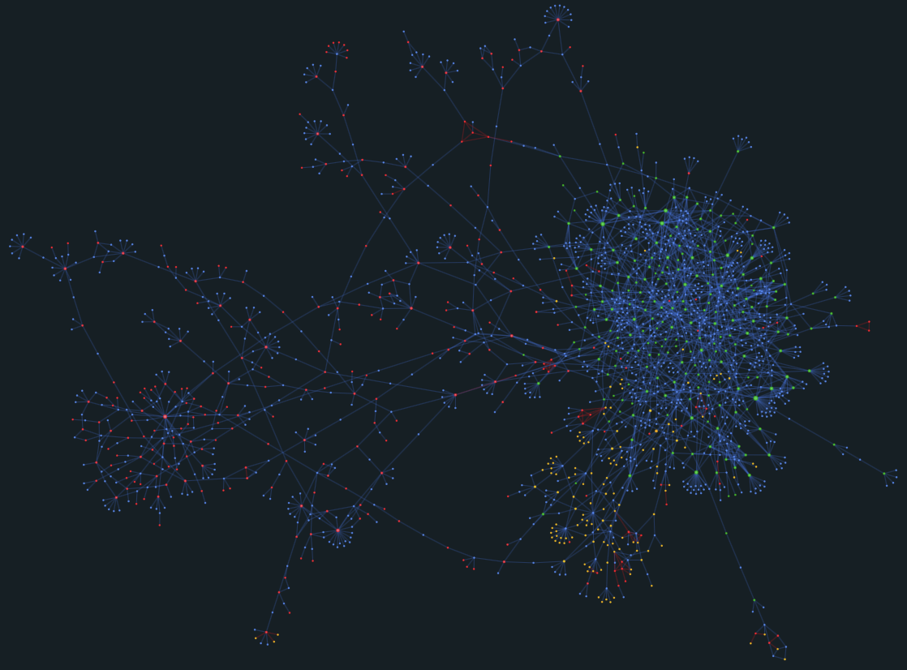

# Pyamgmt

## Introduction

This is a side project created by Ryan Jackson that answers the question of, "How much is too much when it comes to personal asset management software?"

Inspired by first-hand experience of commercial and industrial workplaces, this is developed as a Python/Django-powered solution to tracking both finances and valuable assets.

## Scope

This application focuses on two primary subjects:

1. Financial transactions
2. Personal property

The main concept is for this application to do *more* than what most consumer applications are capable of doing. There are no less than 5 major software applications for budgeting and personal finance - all of which I tried at one point or another, and all of which fell short of what I wanted to be able to do with my bookkeeping. Likewise, there are many small business or enterprise options for finance and asset management, but are above and beyond the needs of individual accounting.

This application aims to be somewhere in the middle of the two. The financial implementation is double-entry accounting, using the familiar format of a register with transactions, payees, line items, and memos. The asset management implementation is a local collection of "items", and split out discrete items like vehicles or appliances as unique entities. The goal is to be able to bridge the two domains such that information like maintenance costs, return on investment, and total cost of ownership can be established - without having to keep related data in two different systems.

Other use cases would be home inventories for insurance purposes, warranty tracking, and maintenance history of valuable equipment.

In addition, I have also added features that focus on my past and present hobbies:

1. Music
   1. Artists and their members
   2. Albums and their editions
   3. Compositions, covers, and other renditions
2. Cars
   1. Manufacturers, models, and production information
   2. NHTSA API integration based on VIN
   3. Mileage over time

Aside from the mileage logs for vehicles, these features are outside the primary scope of the application. They are simply extensions to suit my own interests.

## Example Outputs

### Network visulatization

_Rendering of connections between People, Film, Music, and Video Games_

- _Blue: Person_
- _Red: Music Artist_
- _Green: Film_
- _Yellow: Video Game_

## Backstory

This originally branched from a project that was being developed using Python's native TK library. While that was a fun experience in and of itself, I found `tkinter` to be a bit limiting. Sure, it's cross-platform and built into Python's standard library, but web-based technologies severely outpace what TK offers in terms of interface and scalability.

Rather than using a local application using SQLAlchemy with a local SQLite database, I decided to change my mindset of architecture to better align with the tools that I build commercially. Instead of packaging a Python application that would be installed on one or more machines, and setting up the networking for multiple instances to access the same database, I started to favor the idea of using a "real" web server that locally networked machines could access via HTTP. When I set up the first debugging instance, and realized that I could access my application from my smartphone's browser, I knew there was no going back.

With that in mind, I started to refactor my original project into a Django application.

## Disclaimers

This is very much a personal project that I use for learning and testing technologies that are new to me. It is far from being complete or functional, and may never reach such a stage of where I would call it "done".
